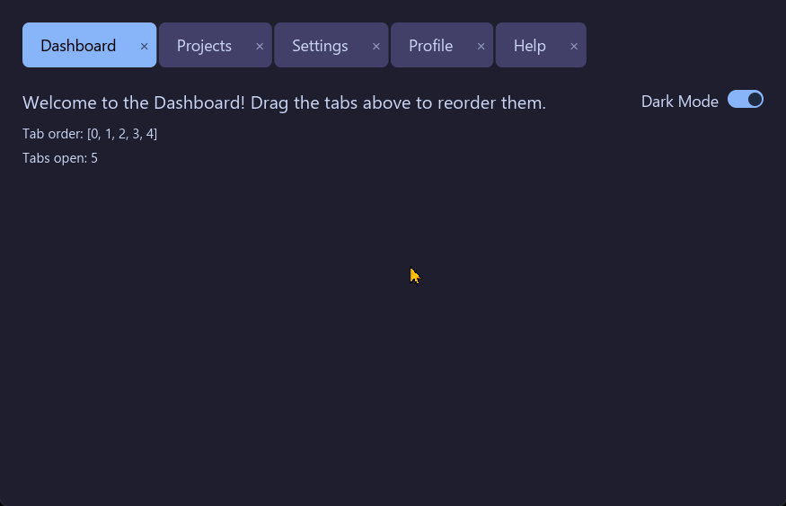

# iced_draggable_tabs

A draggable, reorderable tab bar widget for [Iced](https://iced.rs).

Provides Chrome-style drag-and-drop tab reordering with visual feedback: a ghost tab follows the cursor, the source tab dims as a placeholder, and tabs reorder live as the cursor crosses midpoints.



## Features

- Drag-and-drop tab reordering with configurable threshold
- Ghost tab overlay follows cursor during drag
- Source tab dims to a placeholder while dragging
- Live reorder as cursor crosses tab midpoints
- Theme-aware colors with auto-contrast text
- Optional close buttons on tabs
- Fully customizable styling (colors, borders, padding, text size, opacity)
- Works inside scrollable containers

## Usage

Add to your `Cargo.toml`:

```toml
[dependencies]
iced_draggable_tabs = "0.1"
iced = { version = "0.14", features = ["advanced"] }
```

In your view function:

```rust
use iced_draggable_tabs::DraggableTabs;

let tabs = DraggableTabs::new(
    &["Dashboard", "Projects", "Settings"],
    app.active_tab,
    |idx| Message::TabSelected(idx),
    |new_order| Message::TabsReordered(new_order),
)
.tab_height(40.0)
.text_size(14.0)
.spacing(2.0);
```

### Builder Methods

| Method | Description |
|---|---|
| `tab_height(f32)` | Set tab height in pixels |
| `text_size(f32)` | Set label text size |
| `spacing(f32)` | Gap between tabs |
| `tab_padding(impl Into<Padding>)` | Horizontal padding inside tabs |
| `tab_border(Border)` | Border style for tabs |
| `active_background(Color)` | Background color for the active tab |
| `inactive_background(Color)` | Background color for inactive tabs |
| `active_text_color(Color)` | Text color for the active tab |
| `inactive_text_color(Color)` | Text color for inactive tabs |
| `bar_background(Color)` | Background color for the tab bar |
| `ghost_opacity(f32)` | Ghost tab opacity during drag (0.0-1.0) |
| `drag_threshold(f32)` | Pixels before a click becomes a drag |
| `on_close(Fn(usize) -> Message)` | Enable close buttons with callback |
| `style(TabStyle)` | Apply a complete style configuration |

## Example

Run the included example:

```sh
cargo run --example basic
```

## Requirements

- Iced 0.14 with the `advanced` feature

## License

MIT
